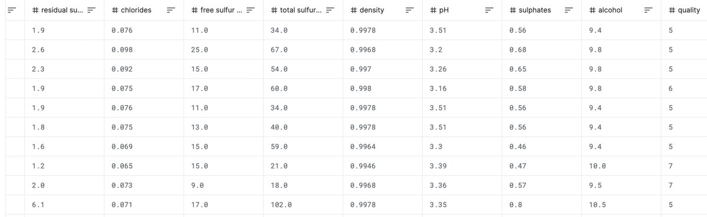

# Red Wine Classification Problem

## Demo Video
[](https://www.youtube.com/watch?v=ZnjsA78RuI4 "Demo-Problem-Statement-Iris-Deployment-Monitoring")

#### [Link to Live demo](www.truefoundry.com)

#### [Blog with instructions on the run](www.truefoundry.com)

## Description of the Problem
---
The aim of the problem is to predict the quality of red-wine as a number between 0-10 with input features like pH, density etc of red-wine.

## Dataset Description
---
Here is the Link to the dataset:  https://www.kaggle.com/code/sevilcoskun/red-wine-quality-classification/data



Size of dataset: 100.95 kb 
Number of Unique Rows: 1599
Total Columns: 12 (11 input features, one the target quality value)

## Model Trained
---
The model trained is a RandomForestClassifier. 
The model is trained using sklearn and we have used GridSearchCV for hyperparameter tuning.


<details>
<summary><b><font size="5">Setting up servicefoundry</font></b></summary>

Install and setup servicefoundry on your computer.

```commandline
pip install servicefoundry
servicefoundry use server https://app.develop.truefoundry.tech
servicefoundry login
```
</details>

<details>
<summary><b><font size="5">Training model</font></b></summary>

To deploy using the python API run the following command in terminal

1. Change working directory to train folder
    ```commandline
    cd train
    ```
2. Create (workspace)[https://docs.truefoundry.com/documentation/deploy/concepts/workspace] and [API key](https://docs.truefoundry.com/documentation/deploy/concepts/secrets) on the TrueFoundry platform 
3. Replace the ``MLF_API_KEY`` value in the train_deploy.py file with the API Key found in [secrets tab](https://app.develop.truefoundry.tech/secrets) of your TrueFoundry account <i>[(Instructions here)](https://docs.truefoundry.com/documentation/deploy/concepts/secrets#how-to-store-secrets-in-truefoundry)</i>
4. Copy the workspace fqn of the workspace that you want to use from the [workspace tab](https://app.develop.truefoundry.tech/workspaces) of TrueFoundry <i>[(Instructions here)](https://docs.truefoundry.com/documentation/deploy/concepts/workspace#copy-workspace-fqn-fully-qualified-name)</i>
5. To deploy using python script:
   ```commandline
   python train_deploy.py --workspace_fqn <YOUR_WORKSPACE_FQN>
   ```
   To deploy using CLI:
   ```commandline
   servicefoundry deploy --file train_deploy.yaml --workspace_fqn <YOUR_WORKSPACE_FQN>
   ```
6. Click on the dashboard link in the terminal
7. Click on the <b>"Trigger Job"</b> on the dashboard to run the training job
</details>

<details>
<summary><b><font size="5">Deploying realtime inference</font></b></summary>

Note: <i>It is necessary to train a model before being able to deploy it as a service</i>
1. Change working directory to infer_realtime folder
    ```commandline
    cd infer_realtime
    ```
2. Create (workspace)[https://docs.truefoundry.com/documentation/deploy/concepts/workspace] and [API key](https://docs.truefoundry.com/documentation/deploy/concepts/secrets) on the TrueFoundry platform 
3. Replace the ``MLF_API_KEY`` value in the infer_realtime_deploy.py file with the API Key found in [secrets tab](https://app.develop.truefoundry.tech/secrets) of your TrueFoundry account <i>[(Instructions here)](https://docs.truefoundry.com/documentation/deploy/concepts/secrets#how-to-store-secrets-in-truefoundry)</i>
4. Copy the workspace_fqn of the workspace that you want to use from the [workspace tab](https://app.develop.truefoundry.tech/workspaces) of TrueFoundry <i>[(Instructions here)](https://docs.truefoundry.com/documentation/deploy/concepts/workspace#copy-workspace-fqn-fully-qualified-name)</i>
5. Find the model_version_fqn of the model that you want to deploy from
   
   * Go to experiments [tracking tab of TrueFoundry](https://app.develop.truefoundry.tech/mlfoundry)
   * Click on the project name that you trained (<i>red-wine-quality-demo by default</i>)
   * Click on models tab
   * Click on the model name to the model trained to open the tab showing different versions of the model
   * Copy the FQN of the latest version of the model
  

6. To deploy using python script:
   ```commandline
   python infer_realtime_deploy.py --workspace_fqn <YOUR_WORKSPACE_FQN> --model_version_fqn <YOUR_MODEL_VERSION_FQN>
   ```
   To deploy using CLI:
   ```commandline
   servicefoundry deploy --file infer_realtime_deploy.yaml --workspace_fqn <YOUR_WORKSPACE_FQN> --model_version_fqn <YOUR_MODEL_VERSION_FQN>
   ```
7. Click on the dashboard link in the terminal to open the service deployment page with FastAPI EndPoint

</details>

<details>
<summary><b><font size="5">Querying the deployed model</font></b></summary>

This can either be done via the [fastapi endpoint](https://red-wine-prediction-tfy-demo.tfy-ctl-euwe1-develop.develop.truefoundry.tech) directly via browser.

You can also query with python script:

```python
request_url = "https://red-wine-prediction-tfy-demo.tfy-ctl-euwe1-develop.develop.truefoundry.tech"
features_list = [
    {
     'fixed_acidity': 7.5,
     'volatile_acidity': 0.42,
     'citric_acid': 0.32,
     'residual_sugar': 2.7,
     'chlorides': 0.067,
     'free_sulfur_dioxide': 7.0,
     'total_sulfur_dioxide': 25.0,
     'density': 0.99628,
     'pH': 3.24,
     'sulphates': 0.44,
     'alcohol': 10.4
    }
]

predictions_list = requests.post(
    url=urljoin(request_url, "/predict"), json=features_list
).json()
```
</details>

<details>
<summary><b><font size="5">Running batch inference</font></b></summary>

1. Change working directory to infer_batch folder
    ```commandline
    cd infer_batch
    ```
2. Create (workspace)[https://docs.truefoundry.com/documentation/deploy/concepts/workspace] and [API key](https://docs.truefoundry.com/documentation/deploy/concepts/secrets) on the TrueFoundry platform 
3. Replace the ``MLF_API_KEY`` value in the infer_realtime_deploy.py file with the API Key found in [secrets tab](https://app.develop.truefoundry.tech/secrets) of your TrueFoundry account <i>[(Instructions here)](https://docs.truefoundry.com/documentation/deploy/concepts/secrets#how-to-store-secrets-in-truefoundry)</i>
4. Copy the workspace_fqn of the workspace that you want to use from the [workspace tab](https://app.develop.truefoundry.tech/workspaces) of TrueFoundry <i>[(Instructions here)](https://docs.truefoundry.com/documentation/deploy/concepts/workspace#copy-workspace-fqn-fully-qualified-name)</i>


</details>

<details>
<summary><b><font size="5">Retraining Model </font></b></summary>


</details>