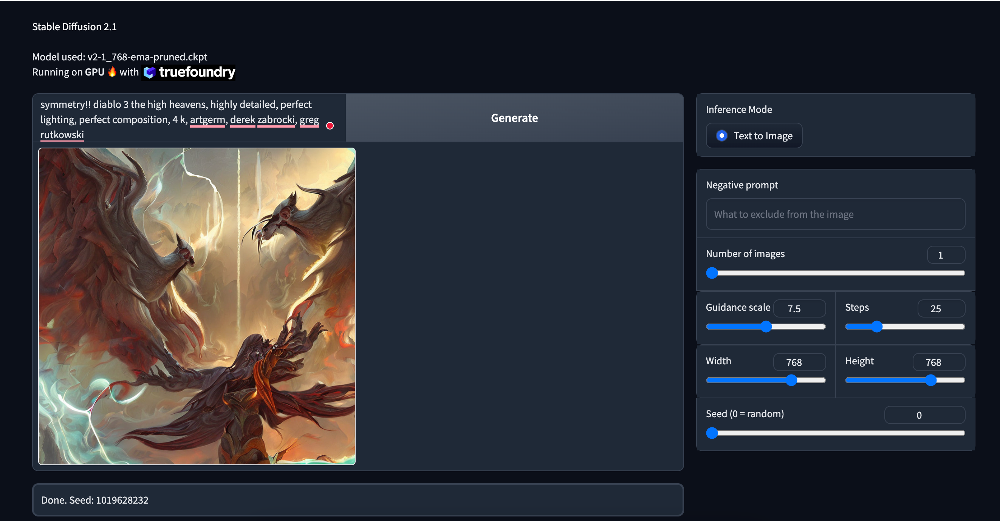

Run Stable Diffusion v2.1 on Truefoundry with GPUs
---
This example downloads and runs [Stable Diffusion v2.1](https://huggingface.co/stabilityai/stable-diffusion-2-1) model on a single Nvidia T4 GPU and 15 GB RAM in FP16 mode using huggingface `transformers` and `diffusers`

Note on resources
---
Although it is possible to load the model using 14.5GB of RAM, to provide some buffer and generate larger texts, `memory_limit` can be increased in `deploy.py`, however that would also mean a larger instance would be provisioned which would cost more.


Deploying the example
---

1. Install servicefoundry

```shell
pip install "servicefoundry>=0.9.0,<0.10.0"
```

2. Login

> Optionally, you can pass in a host using `--host` for hosted truefoundry platform

```shell
sfy login --relogin
```

3. Deploy with your Workspace FQN

E.g.
```shell
python deploy.py --workspace_fqn "tfy-ctl-euwe1-devtest:tfy-demo"
```

Result
---


